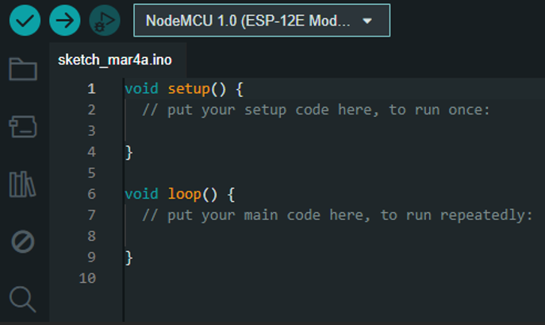
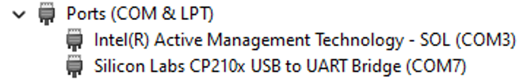
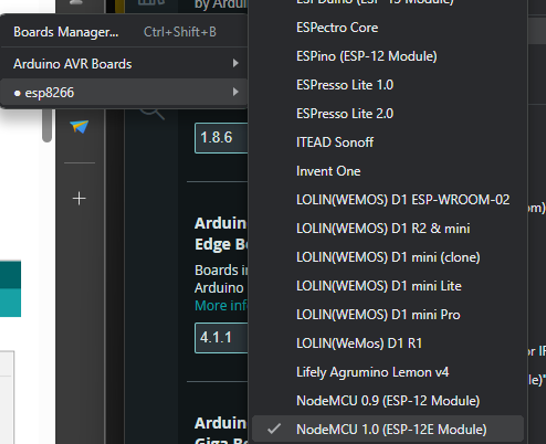
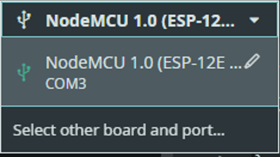
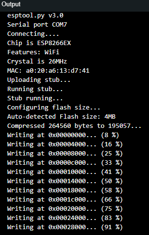
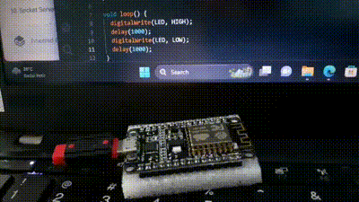

# Arya Wicaksana Hidayat
# TI-3B / 2141720207

-	Buka menu Tools > Board Manager > NodeMCU 1.0
 
 

-	Masukkan kabel data USB dari NodeMCU ke Laptop, kemudian cek terlebih dahulu di Control Panel > Device Manager
 
 

-	Pilih menu Tools > Board, yang semula defaultnya mungkin “Board: Arduino / Genuino Uno” menjadi “NodeMCU 1.0 (ESP-12E Module)”
 
 

-	pada menu Tools > Port > COM3 (sesuaikan dengan nomor port masing-masing)
 
 

-	Jalankan aplikasi standard seperti di bawah ini, kemudian klik tombol centang di bagian toolbar atas.
 
 

-	Hasil

 