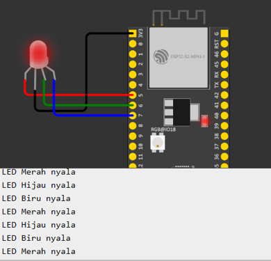
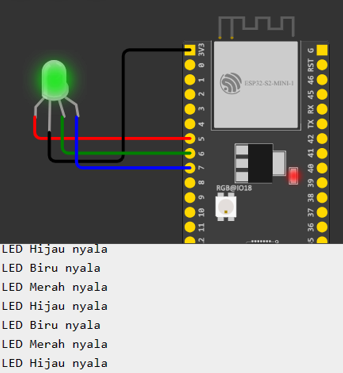
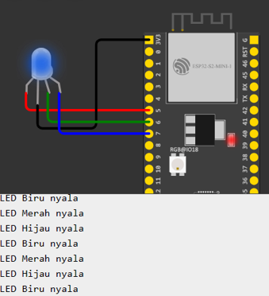

# Week 4

## RGB Code :

    #include <Arduino.h>

    #define RED_LED 5 //led warna merah
    #define GREEN_LED 6 //led warna hijau
    #define BLUE_LED 7 //led warnah biru

    void setup() {
    Serial.begin(115200);
    pinMode(RED_LED,OUTPUT);//atur pin-pin digital sebagai output
    pinMode(GREEN_LED,OUTPUT);
    pinMode(BLUE_LED,OUTPUT);
    Serial.println("Contoh Program LED RGB");
    }

    void rgbLED(){
    digitalWrite(RED_LED, LOW); 
    digitalWrite(GREEN_LED, HIGH); 
    digitalWrite(BLUE_LED, HIGH); 
    Serial.println("LED Merah nyala"); 
    delay(1000); 

    digitalWrite(RED_LED, HIGH); 
    digitalWrite(GREEN_LED, LOW); 
    digitalWrite(BLUE_LED, HIGH); 
    Serial.println("LED Hijau nyala"); 
    delay(1000); 

    digitalWrite(RED_LED, HIGH); 
    digitalWrite(GREEN_LED, HIGH); 
    digitalWrite(BLUE_LED, LOW); 
    Serial.println("LED Biru nyala"); 
    delay(1000);
    }

    void loop() {
    rgbLED();
    }

Result :

 
 
 

# SOS

## Code :

    #include <Arduino.h>

    #define RED_LED 5   //led warna merah
    #define GREEN_LED 6 //led warna hijau
    #define BLUE_LED 7  //led warnah biru

    void setup()
    {
    Serial.begin(115200);
    pinMode(RED_LED, OUTPUT); //atur pin-pin digital sebagai output

    Serial.println("Contoh Program LED SOS");
    }

    void loop()
    {
    // 3 dits (3 titik atau huruf S)
    for (int x = 0; x < 3; x++)
    {
    digitalWrite(RED_LED, HIGH); // LED nyala
    delay(150);                  // delay selama 150ms
    digitalWrite(RED_LED, LOW); // LED mati
    delay(100);                  // delay selama 100ms
    }
    delay(100);

    // 3 dahs (3 garis atau huruf O)
    for (int x = 0; x < 3; x++)
    {
    digitalWrite(RED_LED, HIGH); // LED nyala
    delay(400);                  // delay selama 400ms
    digitalWrite(RED_LED, LOW); // LED mati
    delay(100);                  // delay selama 100ms
    }

    // 100ms delay to cause slight gap between letters
    delay(100);
    // 3 dits again (3 titik atau huruf S)
    for (int x = 0; x < 3; x++)
    {
    digitalWrite(RED_LED, HIGH); // LED nyala
    delay(150);                  // delay selama 150ms
    digitalWrite(RED_LED, LOW); // LED mati
    delay(100);                  // delay selama 100ms
    }

    // wait 5 seconds before repeating the SOS signal
    delay(5000);
    }

# Tugas 

## Code :

    #include <Arduino.h>

    #define RED_LED 2   //led warna merah
    #define GREEN_LED 0 //led warna hijau
    #define BLUE_LED 4  //led warnah biru

    void setup()
    {
    Serial.begin(115200);
    pinMode(RED_LED, OUTPUT);
    pinMode(GREEN_LED,OUTPUT);
    pinMode(BLUE_LED,OUTPUT);
    //atur pin-pin digital sebagai output

    Serial.println("Contoh Program LED SOS");
    }

    void loop()
    {
    // 3 dits (3 titik atau huruf S)
    for (int x = 0; x < 3; x++)
    {
    digitalWrite(RED_LED, LOW); 
    digitalWrite(GREEN_LED, HIGH); 
    digitalWrite(BLUE_LED, HIGH);  // LED nyala
    delay(150);                  // delay selama 150ms
    digitalWrite(RED_LED, HIGH); 
    digitalWrite(GREEN_LED, HIGH); 
    digitalWrite(BLUE_LED, HIGH); // LED mati
    delay(100);                  // delay selama 100ms
    digitalWrite(RED_LED, HIGH); 
    digitalWrite(GREEN_LED, LOW); 
    digitalWrite(BLUE_LED, HIGH);  // LED nyala
    delay(150);                  // delay selama 150ms
    digitalWrite(RED_LED, HIGH); 
    digitalWrite(GREEN_LED, HIGH); 
    digitalWrite(BLUE_LED, HIGH); // LED mati
    delay(100);                  // delay selama 100ms
    digitalWrite(RED_LED, HIGH); 
    digitalWrite(GREEN_LED, HIGH); 
    digitalWrite(BLUE_LED, LOW);  // LED nyala
    delay(150);                  // delay selama 150ms
    digitalWrite(RED_LED, HIGH); 
    digitalWrite(GREEN_LED, HIGH); 
    digitalWrite(BLUE_LED, HIGH); // LED mati
    delay(100);                  // delay selama 100ms
    }
    delay(100);

    // 3 dahs (3 garis atau huruf O)
    for (int x = 0; x < 3; x++)
    {
    digitalWrite(RED_LED, LOW); 
    digitalWrite(GREEN_LED, HIGH); 
    digitalWrite(BLUE_LED, HIGH); 
    delay(400);                  // delay selama 400ms
    digitalWrite(RED_LED, HIGH); 
    digitalWrite(GREEN_LED, HIGH); 
    digitalWrite(BLUE_LED, HIGH);  // LED mati
    delay(100);                  // delay selama 100ms
    digitalWrite(RED_LED, HIGH); 
    digitalWrite(GREEN_LED, LOW); 
    digitalWrite(BLUE_LED, HIGH);  // LED nyala
    delay(400);                  // delay selama 150ms
    digitalWrite(RED_LED, HIGH); 
    digitalWrite(GREEN_LED, HIGH); 
    digitalWrite(BLUE_LED, HIGH); // LED mati
    delay(100);                  // delay selama 100ms
    digitalWrite(RED_LED, HIGH); 
    digitalWrite(GREEN_LED, HIGH); 
    digitalWrite(BLUE_LED, LOW);  // LED nyala
    delay(400);                  // delay selama 150ms
    digitalWrite(RED_LED, HIGH); 
    digitalWrite(GREEN_LED, HIGH); 
    digitalWrite(BLUE_LED, HIGH); // LED mati
    delay(100);                  // delay selama 100ms
    }

    // 100ms delay to cause slight gap between letters
    delay(100);
    // 3 dits again (3 titik atau huruf S)
    for (int x = 0; x < 3; x++)
    {
    digitalWrite(RED_LED, LOW); 
    digitalWrite(GREEN_LED, HIGH); 
    digitalWrite(BLUE_LED, HIGH);  // LED nyala
    delay(150);                  // delay selama 150ms
    digitalWrite(RED_LED, HIGH); 
    digitalWrite(GREEN_LED, HIGH); 
    digitalWrite(BLUE_LED, HIGH);  // LED mati
    delay(100);                  // delay selama 100ms
    digitalWrite(RED_LED, HIGH); 
    digitalWrite(GREEN_LED, LOW); 
    digitalWrite(BLUE_LED, HIGH);  // LED nyala
    delay(150);                  // delay selama 150ms
    digitalWrite(RED_LED, HIGH); 
    digitalWrite(GREEN_LED, HIGH); 
    digitalWrite(BLUE_LED, HIGH); // LED mati
    delay(100);                  // delay selama 100ms
    digitalWrite(RED_LED, HIGH); 
    digitalWrite(GREEN_LED, HIGH); 
    digitalWrite(BLUE_LED, LOW);  // LED nyala
    delay(150);                  // delay selama 150ms
    digitalWrite(RED_LED, HIGH); 
    digitalWrite(GREEN_LED, HIGH); 
    digitalWrite(BLUE_LED, HIGH); // LED mati
    delay(100);                  // delay selama 100ms
    }

    // wait 5 seconds before repeating the SOS signal
    delay(5000);
    }

- Hasil ada di ZIP