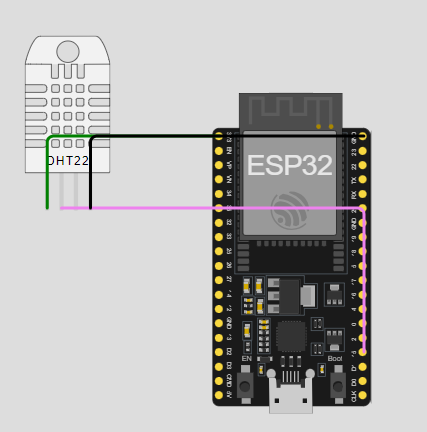
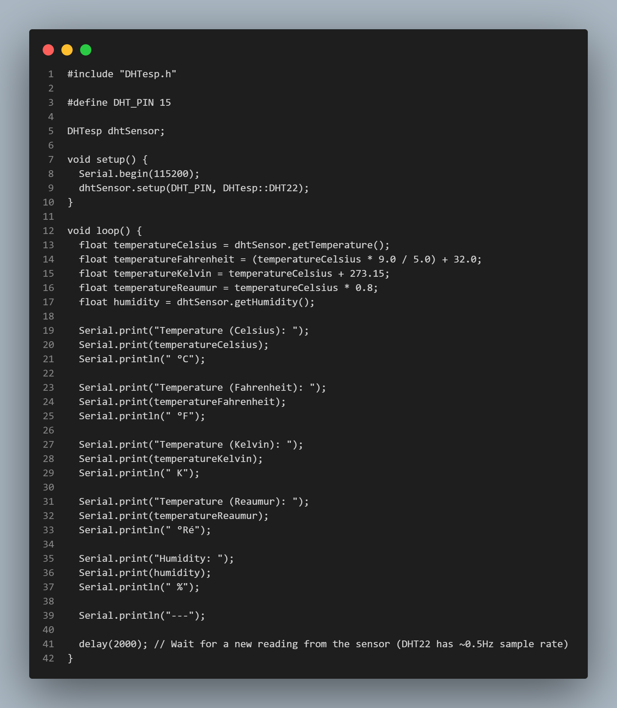

                        IMPLEMENTASI PROGRAM SENSOR SUHU & KELEMBABAN DHT11

### Praktikum - Membaca data suhu dan kelembaban udara

Disini saya menggunakan tools Wokwi untuk mencoba melakukan praktikum ini, berikut adalah gambaran simulasi yang telah saya buat:

Code Program:
