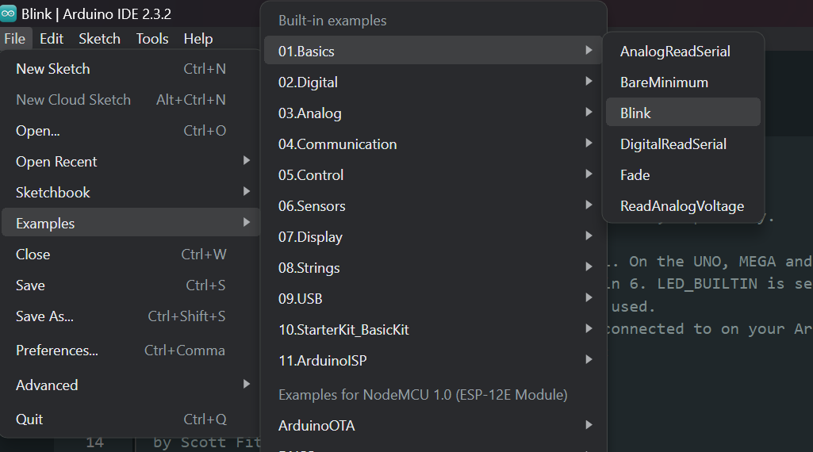

### Nama : ANDI YUDITYA MUSTIKA RAMADANI
### Kelas : TI 3B
### NIM : 2341728039

### PRAKTIKUM 1 (MENGGUNAKAN ARDUIMO IDE)
## A. Install Arduino IDE pada PC dan kemudian jalankan Arduino yang berhasil diinstall
## B. Sambungkan perangkat ESP32CAM ke laptop menggunakan kabel konverter
## C. Proses Pengenalan Port
### 1. Masuk ke control Panel > Device Manager

### 2. Jika port belum terbaca, maka klik kanan port kemudian pilih update dan pilih browse my computer for drivers

### 3.	Masukkan file driver yang telah diinstall dan diestrak

### 4. Jika port sudah terbaca maka port akan muncul seperti gambar dibawah

## D. Melakukan Praktikum menggunakan Arduino IDE
### 1. Pilih Tools > Board “NodeMCU 1.0 (ESP-12E Module)” > esp8266 > NodeMCU 1.0 (ESP-12E Module)

### 2. Pilih port:"COM3"

### 3. Kemudian pilih file > Examples > 01.Basics > Blink. Maka program akan muncul, sesuaikan saja delay LED sesuai keinginan kita

### 4. Program tersebut di save dulu kemudian dijalankan maka hasilnya akan seperti pada gambar dibawah apabila program tersebut berhasil dijalankan dan LED akan on off sesuai dengan delay yang telah di setting

