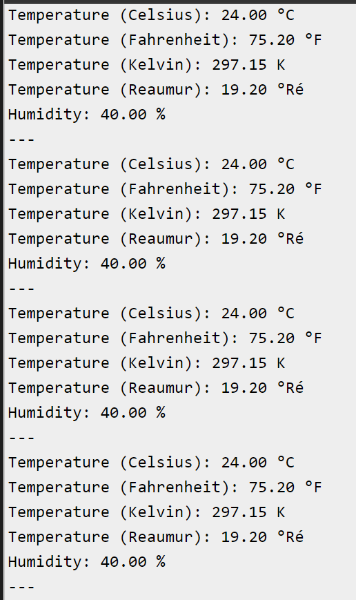

### Nama : ANDI YUDITYA MUSTIKA RAMADANI
### Kelas : TI 3B
### NIM : 2341728039

### Praktikum 1
### Simulasi RGB di wokwi
1. Langkah pertama yaitu masuk ke wokwi terlebih dahulu kemudian pilih esp 32 untuk melakukan praktikum

2. Kemudian tambahkan RGB pada projek dan sambungkan dengan ESP 32, dengan cara :
- kaki pertama RGB yang berwarna merah (red) dipasangkan pada ke pin 19 pada ESP 32
- kaki kedua RGB dipasangkan ke pin 3V3 pada ESP 32
- kaki ketiga RGB yang berwarna hijau (green) dipasangkan pada ke pin 18 pada ESP 32
- kaki keempat RGB yang berwarna biru (blue) dipasangkan pada ke pin 6 pada ESP 32

Perhatikan gambar dibawah ini :
- 

3. Setelah itu mulailah untuk membuat program agar LED nya dapat bekerja sesuai dengan delay yang telah diaturkan, adapun programnya yaitu seperti pada gamabar di bawah ini

Analisis
- Definisi Pin LED: Di bagian ini, pin digital yang terhubung ke LED merah, hijau, dan biru didefinisikan menggunakan #define. Ini memungkinkan untuk menggunakan nama variabel yang lebih deskriptif dalam program dan mempermudah pemeliharaan kode.
- Fungsi setup(): Fungsi ini dijalankan sekali saat program dimulai. Di dalamnya, komunikasi serial diatur dengan baud rate 115200. Kemudian, pin LED diatur sebagai output, dan pesan "Contoh Program LED RGB" dicetak ke port serial.
- Fungsi loop(): Fungsi ini dijalankan secara berulang setelah fungsi setup(). Di dalamnya, fungsi rgbLED() dipanggil untuk mengendalikan LED RGB.
- Fungsi rgbLED(): Fungsi ini mengatur urutan pengaturan LED merah, hijau, dan biru. Setiap LED dinyalakan secara bergantian selama 1 detik, kemudian dimatikan. Pesan yang sesuai juga dicetak ke port serial untuk menandakan warna LED yang sedang dinyalakan.

4.jalankan simulasi, maka LED akan menyala sesuai dengan program yang telah dibuat
### Hasil

### Hasil RGB

### PRAKTIKUM 2
### Simulasi DHT22 di wokwi

1. Langkah pertama yaitu masuk ke wokwi terlebih dahulu kemudian pilih esp 32 untuk melakukan praktikum

2. Kemudian tambahkan DHT11, nah di wokwi tidak ada DHT11 maka kita gunakan DHT22, adapun cara pemasangan pinnya yaitu sebagai berikut :
- Kaki pertama pada DHT22 dipasangkan dengan pin 3V3 pada ESP32
- Kaki kedua pada DHT22 dipasangkan dengan pin 16 pada ESP32
- Kaki ketiga pada DHT22 tidak digunakan
- Kaki keempat pada DHT22 dipasangkan dengan pin GND pada ESP32

Perhatikan gambar dibawah ini
- 

3. Setelah itu mulailah untuk membuat program agar DHT22 nya dapat bekerja, adapun programnya yaitu seperti pada gamabar di bawah ini

Analisis
Kode yang diatas merupakan sebuah program Arduino yang menggunakan sensor DHT22 untuk mengukur suhu dan kelembaban, kemudian mencetak nilai-nilai tersebut dalam berbagai satuan (Celsius, Fahrenheit, Kelvin, dan Reaumur) ke serial monitor.
- Include Library:#include "DHTesp.h": Baris ini mengimpor library DHTesp yang diperlukan untuk berinteraksi dengan sensor DHT. Library ini menyediakan fungsi-fungsi untuk mudahnya membaca nilai suhu dan kelembaban dari sensor.Define Sensor Pin:#define DHT_PIN 15: Baris ini mendefinisikan pin tempat sensor DHT terhubung. Pada contoh ini, pin yang digunakan adalah pin 15.Declare Sensor Object:DHTesp dhtSensor;: Baris ini mendeklarasikan sebuah objek sensor DHT dengan nama dhtSensor. Objek ini akan digunakan untuk berinteraksi dengan sensor DHT sepanjang program.

- Setup Function:void setup() {: Fungsi ini dieksekusi sekali ketika Arduino mulai dijalankan.Serial.begin(115200);: Menginisialisasi komunikasi serial dengan kecepatan baud rate 115200. Hal ini memungkinkan Arduino berkomunikasi dengan serial monitor pada komputer Anda.
dhtSensor.setup(DHT_PIN, DHTesp::DHT22);: Mengkonfigurasi objek sensor DHT untuk menggunakan pin yang ditentukan oleh DHT_PIN dan mengatur model sensor ke DHT22. Ini menginisialisasi sensor untuk digunakan.

- Loop Function:void loop() {: Fungsi ini berjalan terus-menerus setelah fungsi setup selesai dieksekusi.float temperatureCelsius = dhtSensor.getTemperature();: Membaca suhu dalam derajat Celsius dari sensor DHT dan menyimpannya dalam variabel temperatureCelsius.Konversi Suhu: Mengonversi pembacaan suhu dari Celsius ke Fahrenheit, Kelvin, dan Reaumur, menyimpan setiap hasil konversi dalam variabel terpisah.float humidity = dhtSensor.getHumidity();: Membaca kelembaban dari sensor DHT dan menyimpannya dalam variabel humidity.Serial Output: Mencetak pembacaan suhu dan kelembaban ke serial monitor menggunakan fungsi Serial.print() dan Serial.println()

4. Kita juga dapat melakukan edit temperatur dan humidity pada DHT22, seperti pada gambar dibawah ini

5. Jalankan simulasi maka outputnya akan sepert pada gamabr dibawah ini
